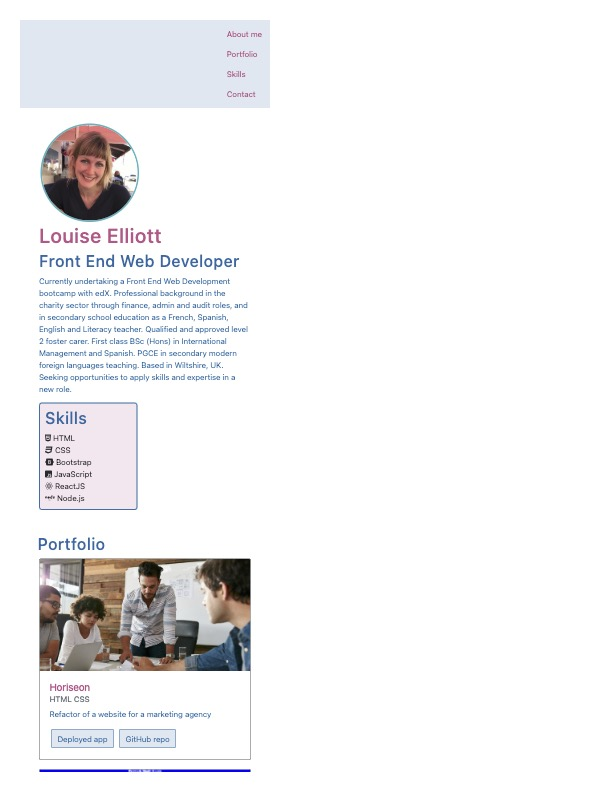
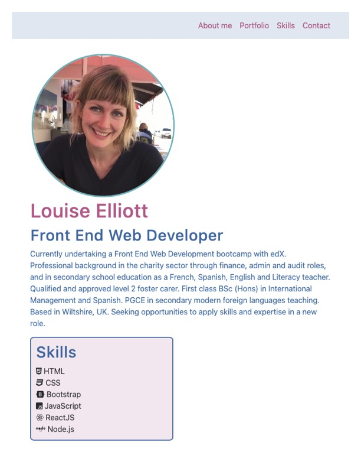
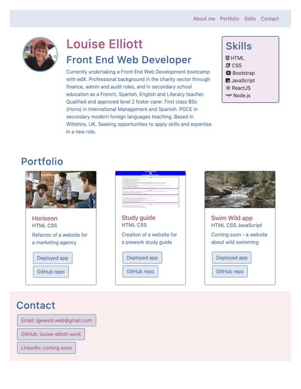
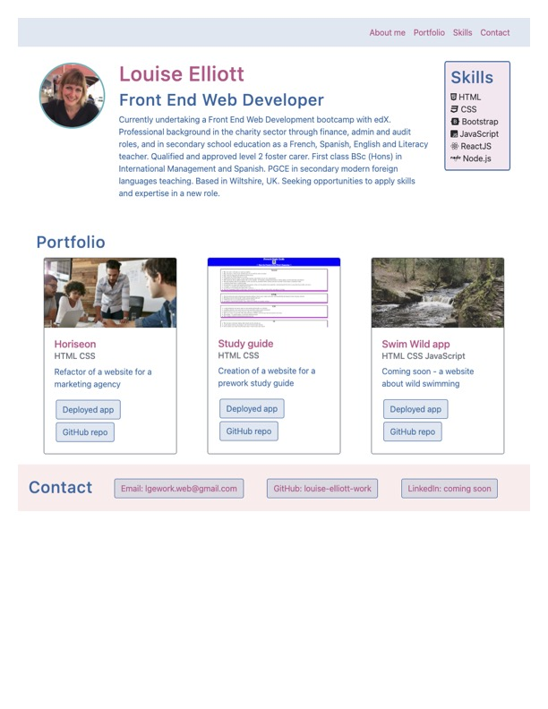
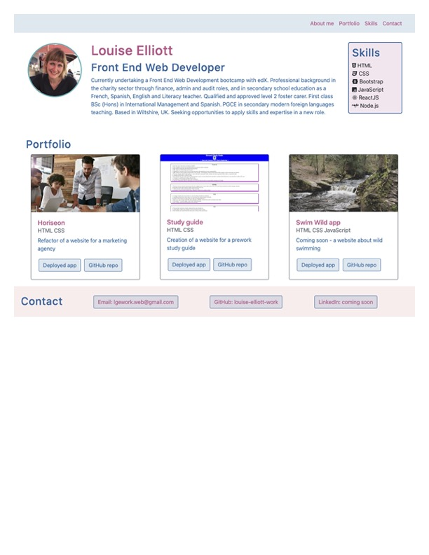
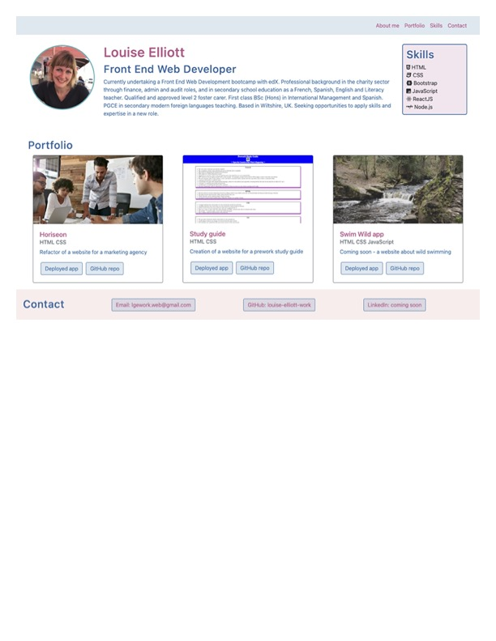

# bootstrap-portfolio

## Description

The aim of this webpage is to provide a profile page that can be added to on an ongoing basis.

It gives potential employers key information and showcases skills and talent by providing images of, and clickable links to, applications refactored and built so far.

It includes: a navigation bar, a jumbotron with a summary profile and a photo, a skills box within the jumbotron, a portfolio section with apps shown on cards and a footer with contact details.

The layout is designed to be clear and easy to navigate for the user, and has been modernised since the previous profile was made.

The branding is consistent throughout by the use of color and font.

The build involved:
- using Bootstrap and its responsive tools ensuring ease of use on a range of devices and viewport widths
- adding effects to all buttons to improve the user experience
- ensuring all links can be clicked to open to make the website as useful as possible for potential employers

## Installation
n/a

## Usage
The webpage has a header with a navigation menu of four items at the top, which link to the sections below when clicked. There is a clear section for each of the four items. First is the profile section with a summary and photo. Alongside it the skills section with a bullet point list and icons. Next is the portfolio section with clickable links for each of the apps developed so far, to both the deployed app and the GitHub repo. In the footer are contact details with links that can be clicked to open.

Screenshots showing responsiveness at different px:

xs-500px

sm-700px

md-900px

lg-1000px

xl-1200px

xxl-1400px

Website link: https://louise-elliott-work.github.io/bootstrap-portfolio

## License

This project is MIT licensed.
